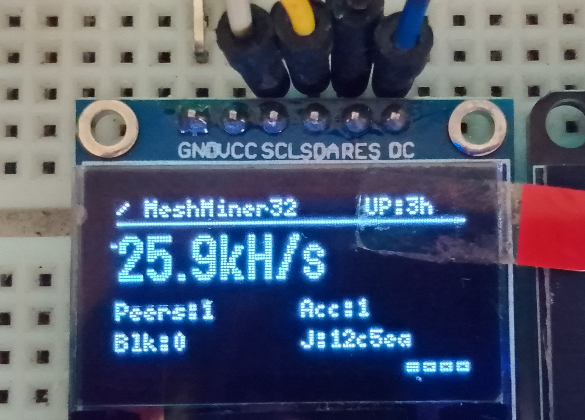
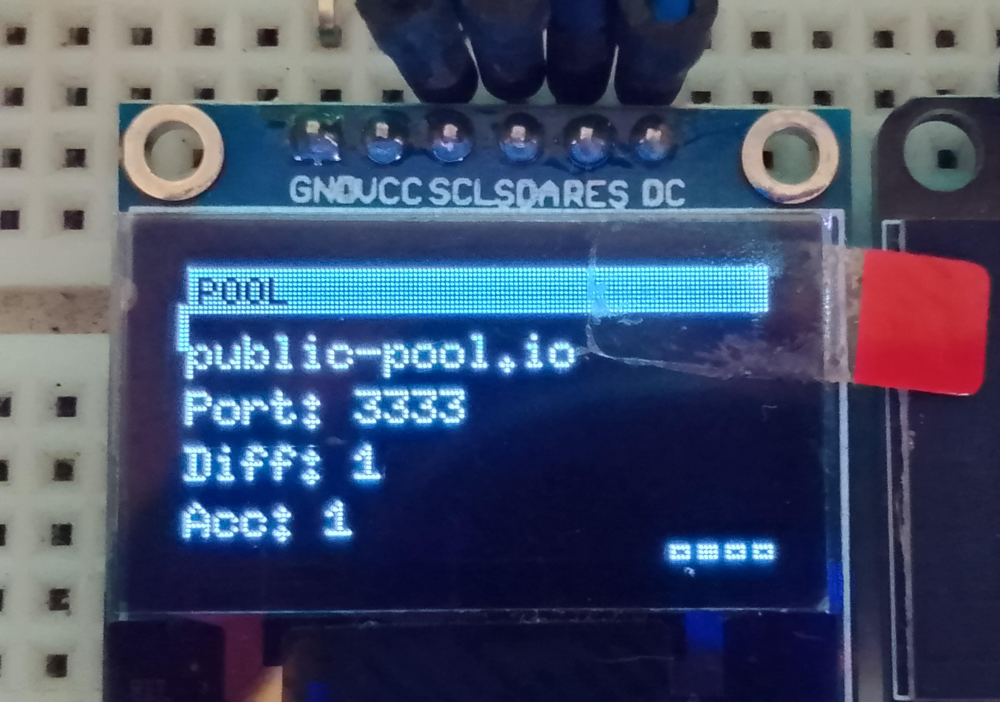
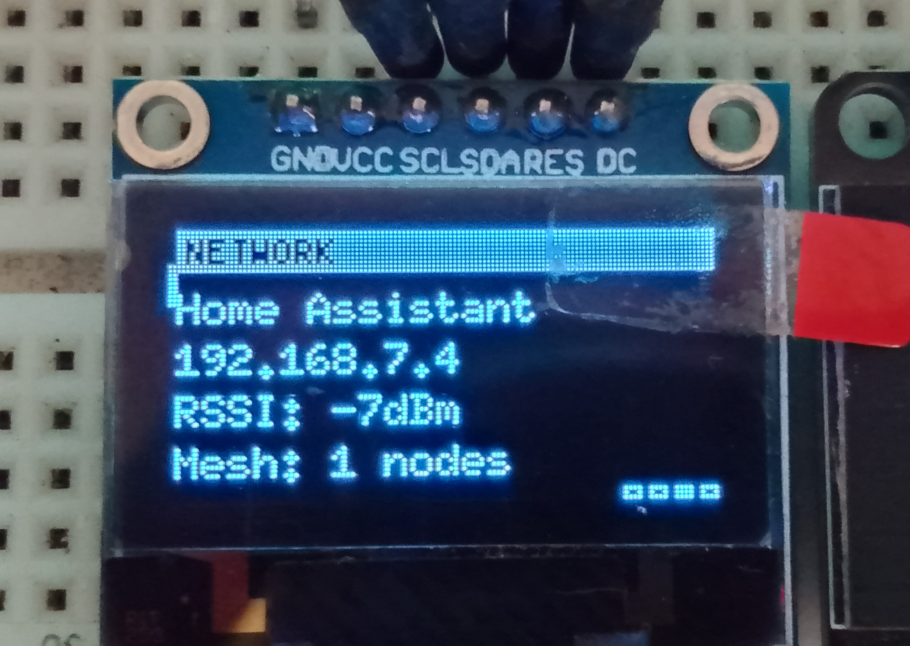
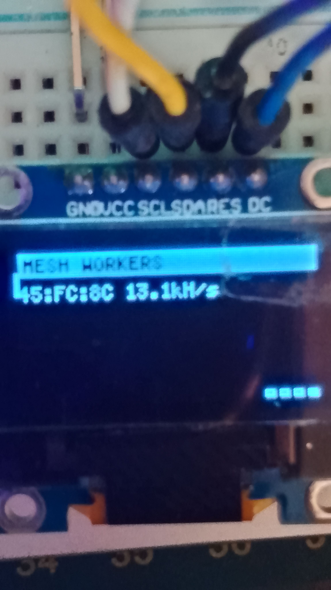

# MeshMiner32

A single-file Arduino sketch that turns ESP32 DevKit V1 boards into a **Bitcoin solo mining mesh**. One node connects to the pool as master; additional nodes join automatically over ESP-NOW and are assigned their own nonce range — no extra WiFi credentials or configuration needed on worker nodes.

Built on top of [NerdMiner v2](https://github.com/BitMaker-hub/NerdMiner_v2) concepts, extended with ESP-NOW mesh networking, leader election, and a 4-page SH1106 OLED display.

---

## Features

- **Mesh networking** — up to 20 ESP32s collaborate over ESP-NOW, splitting the nonce space evenly
- **Auto role assignment** — nodes with WiFi become master; nodes without become workers automatically (`ROLE_AUTO`)
- **Leader election** — if the master goes offline, a worker promotes itself and takes over
- **SH1106 OLED display** — 4 pages cycling: Mining stats, Pool info, Network, Mesh workers
- **Display sleep** — OLED powers off after 30s of inactivity, BOOT button wakes it
- **Channel drift fix** — automatically resyncs ESP-NOW peer channels if the AP changes WiFi channel
- **Non-blocking pool reconnect** — pool outages don't freeze the mining loop
- **Dual-core mining** — both cores mine simultaneously; Core 1 is dedicated, Core 0 fills idle cycles between WiFi/ESP-NOW events; volatile flag handoff keeps cross-core submission safe
- **Built-in LED** — blinks at hash speed (faster = more hashes)
- **Solo mining** via [public-pool.io](https://web.public-pool.io) — 0% fee

---

## Hardware

- ESP32 DevKit V1 (one per node — add as many as you like)
- SH1106 128×64 OLED display (SPI version) — one per node, optional on workers

---

## Wiring (SH1106 SPI OLED)

| OLED pin  | ESP32 pin         |
|-----------|-------------------|
| VCC       | 3.3V              |
| GND       | GND               |
| CLK / D0  | GPIO 18 (HW SCK)  |
| MOSI / D1 | GPIO 23 (HW MOSI) |
| CS        | GND (tied low)    |
| DC        | GPIO 22           |
| RST       | GPIO 4            |

> The built-in blue LED on GPIO 2 blinks at hash speed — no extra wiring needed.

---

## Libraries

Install both via **Arduino Library Manager**:

| Library     | Author     | Version  |
|-------------|------------|----------|
| ArduinoJson | bblanchon  | >= 7.0   |
| U8g2        | olikraus   | >= 2.35  |

---

## Configuration

Edit **Section 1** at the top of `MeshMiner32.ino` before flashing:

```cpp
// WiFi — master node only
#define WIFI_SSID      "your_network"
#define WIFI_PASSWORD  "your_password"

// Pool — replace with your BTC address
#define POOL_HOST  "public-pool.io"
#define POOL_PORT  3333
#define POOL_USER  "bc1qYOURADDRESS.MeshMiner32"
#define POOL_PASS  "x"

// Node role (leave as ROLE_AUTO for all nodes)
#define NODE_ROLE  ROLE_AUTO

// Display sleep timeout in ms (0 = never sleep)
#define DISPLAY_SLEEP_MS  30000
```

Flash the **same sketch** to every node. Nodes that connect to WiFi become master; nodes that can't become workers.

---

## Display Pages

| Page | Content |
|------|---------|
| 0 — Mining  | Hashrate, peers, accepted shares, found blocks, job ID, uptime |
| 1 — Pool    | Pool host, port, difficulty, accepted shares |
| 2 — Network | SSID, IP address, RSSI, mesh node count |
| 3 — Mesh    | Per-worker MAC and hashrate |

Press the **BOOT button** to manually cycle pages or wake the display from sleep.

---

## How the Mesh Works

```
┌─────────────────────────────────────────────┐
│  MASTER (has WiFi)                          │
│  • Connects to Stratum pool                 │
│  • Receives mining jobs                     │
│  • Splits nonce range across all nodes      │
│  • Broadcasts job slices over ESP-NOW       │
│  • Submits found nonces to pool             │
└────────────────┬────────────────────────────┘
                 │ ESP-NOW broadcast
     ┌───────────┴───────────┐
     │                       │
┌────▼──────┐         ┌──────▼─────┐
│ WORKER 1  │   ...   │ WORKER N   │
│ mines its │         │ mines its  │
│ nonce     │         │ nonce      │
│ range     │         │ range      │
└───────────┘         └────────────┘
```

- Master slices `0x00000000–0xFFFFFFFF` evenly across all nodes including itself
- Workers send found nonces back to master via ESP-NOW
- Master submits to pool on behalf of all workers
- If master disappears, workers elect a new one after ~15s

---

## Monitoring

Check your miner live at **https://web.public-pool.io** — enter your BTC address to see hashrate, shares, and worker names.

---

## Expected Performance

| Nodes | Approx combined hashrate |
|-------|--------------------------|
| 1     | ~26 kH/s                 |
| 2     | ~52 kH/s                 |
| 5     | ~130 kH/s                |
| 10    | ~260 kH/s                |
| 20    | ~520 kH/s (ESP-NOW max)  |

Each node runs SHA-256 on both cores simultaneously (~13 kH/s per core). The master's Core 0 mines between WiFi/pool events with no connectivity impact.

> This is a fun hobby project. At ESP32 hashrates the odds of solo mining a block are astronomically low — the reward is learning and building, not Bitcoin.

---

## Serial Monitor

Set baud to **115200**. Key log prefixes:

| Prefix | Meaning |
|--------|---------|
| `[Stratum]` | Pool connection events, jobs, difficulty |
| `[Dispatch]` | Job sent to all nodes |
| `[Redispatch]` | Job re-sent to a specific worker |
| `[Miner0]` / `[Miner1]` | Each core picked up a new job (dual-core, split nonce range) |
| `[Mesh]` | ESP-NOW peer events, channel sync |
| `[Election]` | Master election events |
| `[Display]` | Page flips, sleep/wake |
| `[Found]` | A valid nonce was found |

---

## License

MIT
[README.md](https://github.com/user-attachments/files/26809638/README.md)
# MeshMiner32

A single-file Arduino sketch that turns ESP32 DevKit V1 boards into a **Bitcoin solo mining mesh**. One node connects to the pool as master; additional nodes join automatically over ESP-NOW and are assigned their own nonce range — no extra WiFi credentials or configuration needed on worker nodes.

Built on top of [NerdMiner v2](https://github.com/BitMaker-hub/NerdMiner_v2) concepts, extended with ESP-NOW mesh networking, leader election, and a 4-page SH1106 OLED display.

---

## Features

- **Mesh networking** — up to 20 ESP32s collaborate over ESP-NOW, splitting the nonce space evenly
- **Auto role assignment** — nodes with WiFi become master; nodes without become workers automatically (`ROLE_AUTO`)
- **Leader election** — if the master goes offline, a worker promotes itself and takes over
- **SH1106 OLED display** — 4 pages cycling: Mining stats, Pool info, Network, Mesh workers
- **Display sleep** — OLED powers off after 30s of inactivity, BOOT button wakes it
- **Channel drift fix** — automatically resyncs ESP-NOW peer channels if the AP changes WiFi channel
- **Non-blocking pool reconnect** — pool outages don't freeze the mining loop
- **Cross-core safe** — miner runs on Core 1, all WiFi/ESP-NOW on Core 0 with volatile flag handoff
- **Built-in LED** — blinks at hash speed (faster = more hashes)
- **Solo mining** via [public-pool.io](https://web.public-pool.io) — 0% fee

---

## Hardware

- ESP32 DevKit V1 (one per node — add as many as you like)
- SH1106 128×64 OLED display (SPI version) — one per node, optional on workers

---

## Wiring (SH1106 SPI OLED)

| OLED pin  | ESP32 pin         |
|-----------|-------------------|
| VCC       | 3.3V              |
| GND       | GND               |
| CLK / D0  | GPIO 18 (HW SCK)  |
| MOSI / D1 | GPIO 23 (HW MOSI) |
| CS        | GND (tied low)    |
| DC        | GPIO 22           |
| RST       | GPIO 4            |

> The built-in blue LED on GPIO 2 blinks at hash speed — no extra wiring needed.

---

## Libraries

Install both via **Arduino Library Manager**:

| Library     | Author     | Version  |
|-------------|------------|----------|
| ArduinoJson | bblanchon  | >= 7.0   |
| U8g2        | olikraus   | >= 2.35  |

---

## Configuration

Edit **Section 1** at the top of `MeshMiner32.ino` before flashing:

```cpp
// WiFi — master node only
#define WIFI_SSID      "your_network"
#define WIFI_PASSWORD  "your_password"

// Pool — replace with your BTC address
#define POOL_HOST  "public-pool.io"
#define POOL_PORT  3333
#define POOL_USER  "bc1qYOURADDRESS.MeshMiner32"
#define POOL_PASS  "x"

// Node role (leave as ROLE_AUTO for all nodes)
#define NODE_ROLE  ROLE_AUTO

// Display sleep timeout in ms (0 = never sleep)
#define DISPLAY_SLEEP_MS  30000
```

Flash the **same sketch** to every node. Nodes that connect to WiFi become master; nodes that can't become workers.

---

## Display Pages

| Page | Content |
|------|---------|
| 0 — Mining  | Hashrate, peers, accepted shares, found blocks, job ID, uptime |
| 1 — Pool    | Pool host, port, difficulty, accepted shares |
| 2 — Network | SSID, IP address, RSSI, mesh node count |
| 3 — Mesh    | Per-worker MAC and hashrate |

Press the **BOOT button** to manually cycle pages or wake the display from sleep.

---

## How the Mesh Works

```
┌─────────────────────────────────────────────┐
│  MASTER (has WiFi)                          │
│  • Connects to Stratum pool                 │
│  • Receives mining jobs                     │
│  • Splits nonce range across all nodes      │
│  • Broadcasts job slices over ESP-NOW       │
│  • Submits found nonces to pool             │
└────────────────┬────────────────────────────┘
                 │ ESP-NOW broadcast
     ┌───────────┴───────────┐
     │                       │
┌────▼──────┐         ┌──────▼─────┐
│ WORKER 1  │   ...   │ WORKER N   │
│ mines its │         │ mines its  │
│ nonce     │         │ nonce      │
│ range     │         │ range      │
└───────────┘         └────────────┘
```

- Master slices `0x00000000–0xFFFFFFFF` evenly across all nodes including itself
- Workers send found nonces back to master via ESP-NOW
- Master submits to pool on behalf of all workers
- If master disappears, workers elect a new one after ~15s

---

## Monitoring

Check your miner live at **https://web.public-pool.io** — enter your BTC address to see hashrate, shares, and worker names.

---

## Expected Performance

| Nodes | Approx combined hashrate |
|-------|--------------------------|
| 1     | ~25–30 kH/s              |
| 2     | ~50–60 kH/s              |
| 4     | ~100–120 kH/s            |

> This is a fun hobby project. At ESP32 hashrates the odds of solo mining a block are astronomically low — the reward is learning and building, not Bitcoin.

---

## Serial Monitor

Set baud to **115200**. Key log prefixes:

| Prefix | Meaning |
|--------|---------|
| `[Stratum]` | Pool connection events, jobs, difficulty |
| `[Dispatch]` | Job sent to all nodes |
| `[Redispatch]` | Job re-sent to a specific worker |
| `[Miner]` | Mining task picked up a new job |
| `[Mesh]` | ESP-NOW peer events, channel sync |
| `[Election]` | Master election events |
| `[Display]` | Page flips, sleep/wake |
| `[Found]` | A valid nonce was found |

---

## License

MIT
ng README.md…]()
# MeshMiner32

A DIY Bitcoin solo miner built on ESP32 DevKit V1 boards using ESP-NOW mesh networking, a SH1106 SPI OLED display, and public-pool.io.

Multiple ESP32 boards work together as a mesh — one **master** connects to WiFi and the Bitcoin mining pool, while **worker** nodes receive job assignments over ESP-NOW and hash their portion of the nonce space independently. The more workers you add, the higher the combined hashrate.



---

## Features

- **ESP-NOW mesh** — no router needed between nodes, works peer-to-peer
- **Auto nonce splitting** — master divides the nonce space evenly across all workers
- **SH1106 SPI OLED** — 4 rotating info pages on the master (Mining, Pool, Network, Mesh Workers)
- **Boot screen** — Bitcoin B logo with MeshMiner32 name on startup
- **Mining spinner** — animated indicator shows active hashing
- **Blue LED** — blinks proportional to hash speed on both master and worker
- **Fallback election** — if master goes offline, workers elect a new master automatically
- **Cross-core safe** — miner runs on Core 1, WiFi/ESP-NOW safely handled on Core 0
- **public-pool.io** — 0% fee solo pool, 100% of block reward goes to your address
- **Scalable** — add as many worker ESP32s as you want, each auto-joins and gets a nonce slice

---

## Hardware Required

### Per node (master or worker)
| Part | Notes |
|------|-------|
| ESP32 DevKit V1 | Any ESP32-WROOM-32 based board |
| USB cable | For flashing and power |

### Master only
| Part | Notes |
|------|-------|
| SH1106 128x64 OLED | SPI version, 6-pin (no CS pin) |
| Jumper wires | 5 wires for OLED |

---

## OLED Wiring (Master only)

```
SH1106 OLED    ESP32 DevKit V1
-----------    ---------------
VCC / 3V3  ->  3.3V
GND        ->  GND
SCL        ->  GPIO 18  (HW SPI SCK)
SDA        ->  GPIO 23  (HW SPI MOSI)
RES        ->  GPIO 4   (D4)
DC         ->  GPIO 2   (D2)
CS         ->  GND on module (no wire needed)
```

---

## Software Setup

### Libraries (install via Arduino IDE Library Manager)

**Master** requires:
- `ArduinoJson` >= 7.0 by bblanchon
- `U8g2` >= 2.35 by olikraus

**Worker** requires:
- No extra libraries needed

### Board settings (Arduino IDE)
- Board: **ESP32 Dev Module**
- Upload Speed: 921600
- Partition Scheme: Default

---

## Configuration

### Master — edit the top of `MeshMiner32.ino`

```cpp
#define WIFI_SSID     "YourWiFiName"
#define WIFI_PASSWORD "YourWiFiPassword"
#define POOL_USER     "bc1qYourBitcoinAddress.MeshMiner32"
```

> Your Bitcoin address must be a native SegWit `bc1q...` address.
> Get one free from [BlueWallet](https://bluewallet.io) or [Electrum](https://electrum.org).

### Worker — edit the top of `MeshMiner32_Worker.ino`

```cpp
#define ESPNOW_CHANNEL  11   // Must match your router's WiFi channel
```

> Flash the master first. Check Serial Monitor for `[Main] WiFi channel: N`.
> Set that number here on all worker boards.

---

## Flashing

1. Open `MeshMiner32.ino` in Arduino IDE — flash to the **master** board
2. Open `MeshMiner32_Worker.ino` in Arduino IDE — flash to each **worker** board
3. Power both boards — workers auto-discover the master within seconds

Each `.ino` file must be inside a folder with the **exact same name**.

---

## Display Pages (Master)

The OLED cycles through 4 pages every 3 seconds. Press the **BOOT button** to advance manually.

| Page | Content |
|------|---------|
| **Mining** | Spinner, hashrate, peers, accepted shares, found blocks, job ID |
| **Pool** | Pool host, port, difficulty, accepted shares |
| **Network** | WiFi SSID, IP address, RSSI signal strength, mesh node count |
| **Mesh Workers** | Each worker MAC address and hashrate |

---

## Monitoring on public-pool.io

1. Go to [https://web.public-pool.io](https://web.public-pool.io)
2. Enter your `bc1q...` Bitcoin address
3. Your miner appears as **MeshMiner32** after the first accepted share

---

## How It Works

```
Bitcoin Network
      |
      | Stratum protocol
      v
  MASTER ESP32  ---- WiFi ----  public-pool.io
      |
      | ESP-NOW (2.4GHz, no router needed)
      |
  +---+-------------------+
  |                       |
WORKER 1              WORKER 2
nonce 0x00000000      nonce 0x80000000
  to 0x7FFFFFFF          to 0xFFFFFFFF
```

- Master connects to the pool and receives Bitcoin block templates
- Nonce space is split evenly: master takes chunk 0, workers get the rest
- Each node hashes its range independently using double-SHA256
- If a valid nonce is found, worker sends it to master via ESP-NOW
- Master submits the result to the pool via Stratum

---

## Expected Performance

| Nodes | Combined Hashrate |
|-------|------------------|
| 1 master only | ~25 kH/s |
| 1 master + 1 worker | ~50 kH/s |
| 1 master + 3 workers | ~100 kH/s |

---

## Photos

| Mining page | Pool page |
|-------------|-----------|
|  |  |

| Network page | Mesh Workers page |
|--------------|-------------------|
|  |  |

---

## File Structure

```
MeshMiner32/
├── MeshMiner32.ino          # Master node sketch
├── MeshMiner32_Worker.ino   # Worker node sketch
├── photos/
│   ├── mining.jpg
│   ├── pool.jpg
│   ├── network.jpg
│   └── mesh.jpg
└── README.md
```

---

## Disclaimer

Bitcoin solo mining with an ESP32 is a hobby project. The probability of finding
a block is extremely low. This project is for educational purposes and the joy
of building — not as a financial strategy.

---

## License

MIT License — free to use, modify and share. Credit appreciated but not required.

---

## Acknowledgements

Inspired by the original [NerdMiner v2](https://github.com/BitMaker-hub/NerdMiner_v2) project by BitMaker.
Built with [U8g2](https://github.com/olikraus/u8g2) display library and [ArduinoJson](https://arduinojson.org).
Solo mining via [public-pool.io](https://web.public-pool.io) — 0% fee, open source.
